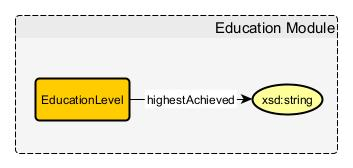
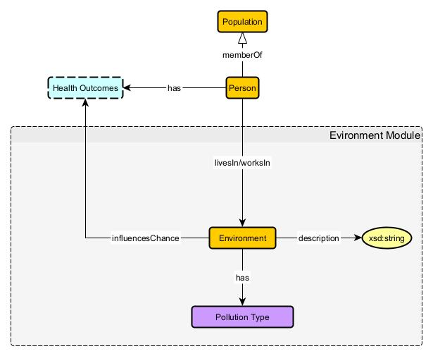
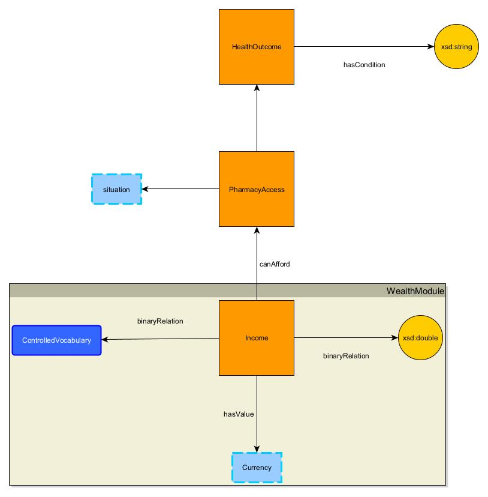
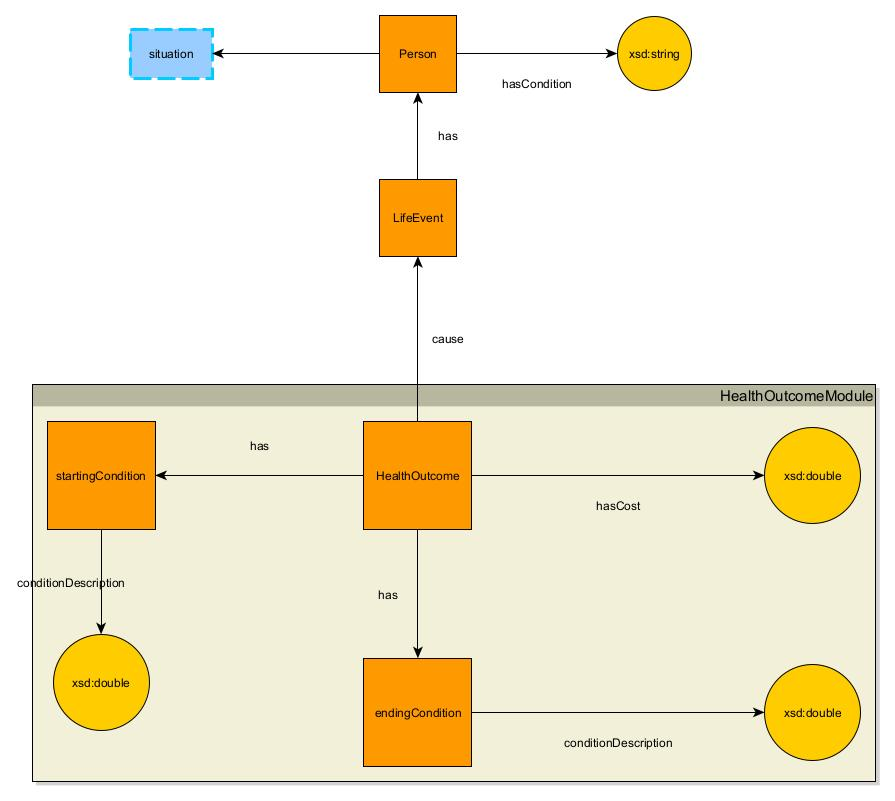
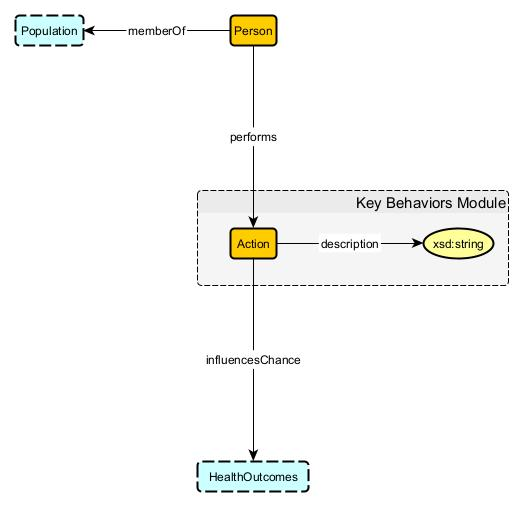
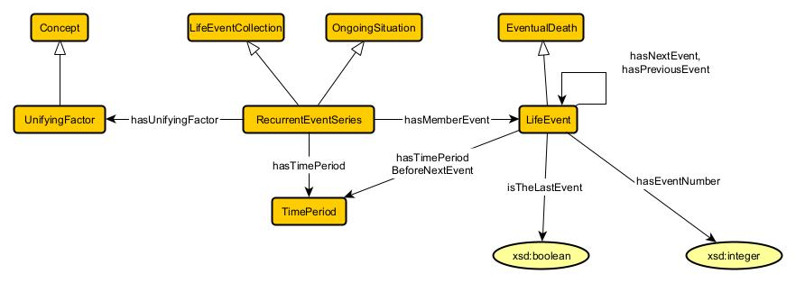
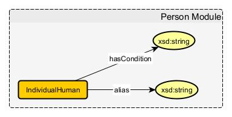
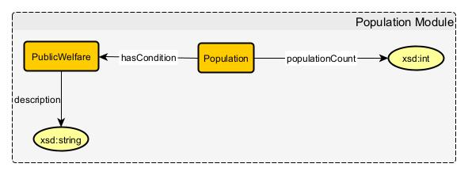
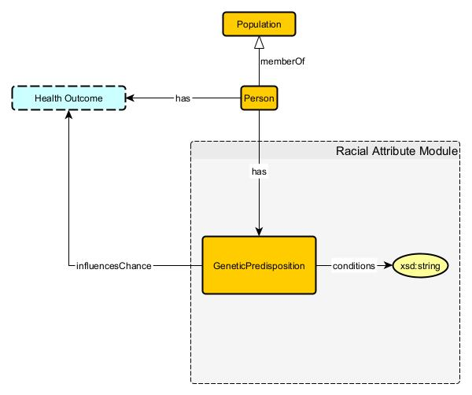
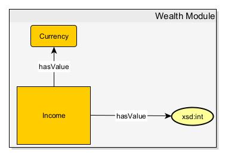

# Factorizing Determinants of Human Health

## Education Module

### Axioms
* `EducationLevel subClassOf Education`  
If there is Education, there is an EducationLevel descriptor.
* `EducationLevel subClassOf Education some Income.`  
If there is some EducationLevel, it is usually an influence on Income level.

## Environment Module

### Axioms
* `Environment some describable PollutionType`  
If an Environment exists, it must have some description of its PollutionType (including "clean"/"sterile").
* `Environment some HealthOutcome`  
If an Environment exists, it may influence the chance of certain HealthOutcomes.

## HealthcareAccess Module

### Axioms
* `HospitalAccess subClassOf HealthcareAccess`  
HospitalAccess is a component of HealthcareAccess.
* `PharmacyAccess subClassOf HealthcareAccess`  
PharmacyAccess is a component of HealthcareAccess.
* `Pharmacyaccess DisjointWith HospitalAccess`  
A Hospital oftentimes contains its own Pharmacy, but the concern of PharmacyAccess is to supply an IndividualHuman with medication for treating a Condition outside of a Hospital setting.
* `HealthcareAccess subClassOf HealthcareAccess Module some Healthcare`  
If there is HealthcareAccess, then there is some level of Healthcare accessible.
* `EndingFix subClassOf HealthcareAccess Module some HealthOutcome`  
If there is an EndingFix, there is some (positive or negative) influence on a HealthOutcome.

## HealthOutcomes Module

### Axioms
* `HealthOutcome subClassOf LifeEvent some Cost`  
A HealthOutcome is a type of LifeEvent that has some Cost and influences further LifeEvents.
* `HealthOutcome subClassOf LifeEvent some startingCondition`  
If there is a HealthOutcome then there is a startingCondition with descriptor conditionDescription.
* `HealthOutcome subClassOf LifeEvent some endingCondition`  
If there is a HealthOutcome then there is an endingCondition with descriptor conditionDescription.

## KeyBehaviors Module

### Axioms
* `Action subClassOf KeyBehaviors some description`  
If an Action exists, it must have some description.
* `Action subClassOf KeyBehaviors some HealthOutcome`  
If an Action exists, it must have some influence on some HealthOutcome.

## Life Module

### Axioms
* `LifeSpan subClassOf Life some measureOfTime`  
If a LifeSpan exists, its length of Time can be measured.

## LifeEvent Module

### Axioms
* `LifeEvent subClassOf RecurrentEvent some LifeEvent`  
LifeEvents lead to more LifeEvents until the cycle reaches EventualDeath.
* `EventualDeath subClassOf LifeEvent max 1 LifeSpan`  
If LifeEvents occur, there will be an EventualDeath which is the ending point of an IndividualHuman's LifeSpan.

## Location Module

### Axioms
* `Location some HealthcareAccess`  
If some Location exists, it has some influence on HealthcareAccess services, including distance to Hospitals, Pharmacies, and other Healthcare services.

## Person

### Axioms
* `IndividualHuman subClassOf Person max 1 LifeSpan`  
If an IndividualHuman exists, that IndividualHuman has at most one LifeSpan.
* `IndividualHuman subClassOf Person some RacialAttribute`  
If an IndividualHuman exists, that IndividualHuman has some RacialAttribute.
* `IndividualHuman subClassOf Person max 1 EducationLevel`  
If an IndividualHuman exists, that IndividualHuman has at most one generally-quantifiable EducationLevel.
* `IndividualHuman subClassOf Person max 1 Income`  
If an IndividualHuman exists, that IndividualHuman has at most one total quantifiable Income.
* `IndividualHuman subClassOf Person max 1 alias`  
If an IndividualHuman exists, that IndividualHuman has at most one alias in the data. This alias must be kept anonymized in the model for privacy and security reasons.
* `IndividualHuman subClassOf Person some Condition`  
If an IndividualHuman exists, that IndividualHuman has some describable Condition (healthy, ill, etc.).
* `IndividualHuman subClassOf Person some Environment`  
If an IndividualHuman exists, that IndividualHuman must inhabit some describable Environment, and may work in the same or a different Environment.
* `IndividualHuman subClassOf Person some Population`  
If an IndividualHuman exists, that IndividualHuman is a member of some Population.
* `IndividualHuman subClassOf Person some Action`  
If an IndividualHuman exists, that IndividualHuman performs some Action.

## Population Module

### Axioms
* `Population some Location`  
If a Population exists, it must have some describable Location.
* `PublicWelfare subClassOf Population some Condition`  
If a Population exists, it must have some description of its PublicWelfare.

## RacialAttribute Module

### Axioms
* `GeneticPredisposition subClassOf RacialAttribute some Condition`  
If a RacialAttribute includes a given GeneticPredispostion, there are corresponding medical Conditons that are more likely.
* `GeneticPredisposition subClassOf RacialAttribute some HealthOutcome`  
If a RacialAttribute includes a given GeneticPredispostion, there are corresponding HealthOutcomes that could arise from the predisposed Conditions.

## Wealth

### Axioms
* `Currency subClassOf Income some Value`  
If Currency is a type of Income, it has some quantifiable monetary Value.
* `Income subClassOf WealthModule some Healthcare`  
If Wealth exists, some level of Healthcare can be afforded.
* `Income subClassOf WealthModule some EducationLevel.`  
If a Person has some Income, it enables that Person to obtain some EducationLevel.