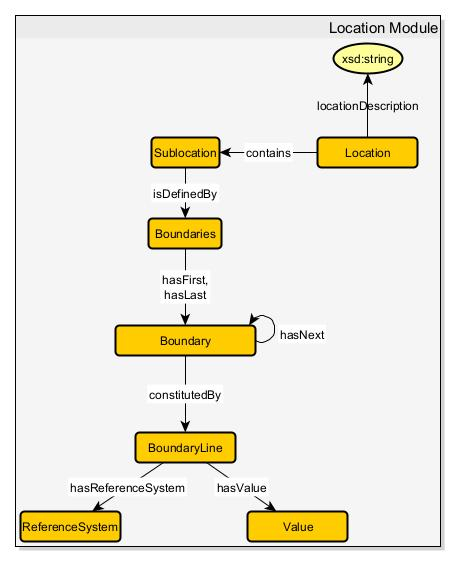

# Factorizing Determinants of Human Health
**Authors:** Nicholas Latham · Chris Nodel · Van Quoc Huy Vo

---

# Agenda
- Use case (narrative)
- Competency questions
- Integrated datasets
- Modules (one slide per module)
- Overall knowledge graph & schema
- Retrospective

---

# Use Case — Narrative (1/2)
Life expectancy is the average number of years a person can expect to live. It is shaped by genetics **and** environmental, social, and behavioral factors.

Across Ohio there are disparities by county, ZIP, and neighborhood — giving us a use case for a data-driven knowledge graph that integrates many datasets to estimate life expectancy and surface drivers of disparities.

---

# Use Case — Narrative (2/2)
**Objective:** Build a scalable knowledge graph that estimates life expectancy across Ohio counties and supports analysis by public health experts, policymakers, and community organizations.

**Key inputs:** environmental exposures (lead, air/water quality), health behaviors (smoking, diet, exercise, sleep), healthcare access, demographic/population data, and health outcomes (mortality, infant mortality, disease rates).

References: NIEHS (air pollution), BMJ Oncology (air pollution & cancer), National Sleep Foundation (sleep quality).

---

# Competency Questions
- How do lead levels affect life expectancy?  
  *(Blood Lead Levels ↔ Mortality)*
- Is RSV more dangerous to adults than infants?  
  *(Respiratory dashboard ↔ Mortality ↔ Infant mortality)*
- Is secondhand smoke more dangerous than vaping?  
  *(eCigarette Use ↔ Tobacco Use ↔ Mortality)*
- Does pharmacy access improve mental health outcomes?  
  *(Pharmacy Access ↔ Behavioral Health Claims)*
- Do diabetes prevention programs decrease diabetes-related hospitalizations?  
  *(National DPP ↔ Hospital data)*
- Which infectious diseases correlate with higher infant mortality?  
  *(Summary of Infectious Diseases ↔ Infant Mortality)*

---

# Integrated Datasets — Overview (1/2)
Selected public datasets integrated into the model (examples):
- Behavioral Health Claims Dashboard — demographics, diagnosis types  
- Blood Lead Testing (public) — year, age group, µg/dL  
- ODH Respiratory Dashboard — flu, COVID-19, RSV, hospitalizations  
- Infant Mortality Scorecard — birth outcomes, maternal characteristics

---

# Integrated Datasets — Overview (2/2)
More datasets:
- Mortality — county, year, death counts  
- Ohio BRFSS (data & annual report) — conditions, education, percent affected  
- Ohio Pharmacy Access — location, open/close dates, pharmacy_type  
- National DPP Locator Map — diabetes prevention program locations  
- Hospital Registration Information — facility-level services and capacities

---

# Module: Education
**Source pattern:** Reporting event  
**Source data:** Behavioral Health Claims, Hospital Registration, BRFSS

**Description:** Education level influences income, health behaviors, and access to care — downstream effects on health outcomes.

**Key axioms (summary):**
- `EducationLevel subClassOf Education`
- `EducationLevel subClassOf Education some Income`
- `EducationLevel subClassOf Education some Action`

---

# Module: Environment
**Source pattern:** Reporting event  
**Source data:** Blood Lead Testing, environmental datasets

**Description:** Air/water/pollution influence health (respiratory disease, cancer) and thus life expectancy.

**Key axioms (summary):**
- `Environment subClassOf ... some PollutionType`
- `Environment subClassOf ... some HealthOutcome`

---

# Module: Healthcare Access
**Source pattern:** Reporting event  
**Source data:** Best Hospitals, Hospital Registration, Pharmacy Access, National DPP

**Description:** Access to hospitals, pharmacies, and programs affects treatment, medication adherence, and outcomes.

**Key axioms (summary):**
- `HospitalAccess subClassOf HealthcareAccess`
- `PharmacyAccess subClassOf HealthcareAccess`
- `EndingFix subClassOf HealthcareAccess Module some HealthOutcome`

---

# Module: HealthOutcomes
**Source pattern:** Recurring event  
**Source data:** Mortality, Cancer stats, Behavioral Claims, Infectious disease summaries

**Description:** Health events (disease, hospitalization, death) are the primary outcomes we model and link to exposures and behaviors.

**Key axioms (summary):**
- `HealthOutcome subClassOf LifeEvent`
- `HealthOutcome subClassOf LifeEvent some Cost`
- `HealthOutcome subClassOf LifeEvent some startingCondition`

---

# Module: KeyBehaviors
**Source pattern:** Reporting event  
**Source data:** BRFSS, Tobacco/eCigarette datasets, Behavioral Claims

**Description:** Behaviors such as smoking, vaping, diet, exercise, and sleep are tracked and linked to health outcomes.

**Key axioms (summary):**
- `Action subClassOf KeyBehaviors some description`
- `Action subClassOf KeyBehaviors some HealthOutcome`

---

# Module: Life & LifeEvent
**Source pattern:** Reporting / Recurring events  
**Source data:** Mortality, Infant Mortality Scorecard, Hospital Data

**Description:** LifeEvents (birth, hospitalization, death) form the temporal backbone; Life module represents lifespan measures.

**Key axioms (summary):**
- `LifeSpan subClassOf Life some measureOfTime`
- `EventualDeath subClassOf LifeEvent max 1 LifeSpan`

---

# Module: Location & Population
**Source pattern:** Reporting event / Quantity  
**Source data:** Population Data for Rates, Hospital Registration, BRFSS

**Description:** Geography (county / ZIP / tract) determines environmental exposures, access to care, and aggregated population measures (rates).

**Key axioms (summary):**
- `Population subClassOf Population Module some Location`
- `Location subClassOf Location Module some HealthcareAccess`

---

# Module: Person & RacialAttribute
**Source pattern:** Agent / Reporting event  
**Source data:** Behavioral Claims, BRFSS, Population Data

**Description:** Individual-level entities (IndividualHuman) with demographics, education, income, behaviors, and health outcomes.

**Representative axioms:**
- `IndividualHuman subClassOf Person max 1 LifeSpan`
- `IndividualHuman subClassOf Person some RacialAttribute`
- `GeneticPredisposition subClassOf RacialAttribute some HealthOutcome`

---

# Module: Wealth
**Source pattern:** Reporting event  
**Source data:** Behavioral Claims, Hospital Registration, BRFSS

**Description:** Income/wealth link to healthcare access and education, modifying risk and resilience.

**Axioms (summary):**
- `Currency subClassOf Income some Value`
- `Income subClassOf WealthModule some HealthcareAccess`
- `Income subClassOf WealthModule some EducationLevel`

---

# The Overall Knowledge Graph
**Namespaces**: (prefixes to be defined in the repo/OWL)

**High-level connections**
- `Person` — linked to → `Location`, `EducationLevel`, `Income`, `HealthBehavior`, `HealthOutcome`  
- `Population` — aggregates → `Person` and provides rates used to normalize outcomes  
- `Environment` — influences → `HealthOutcome` (direct exposure links)  
- `HealthcareAccess` — mediates → `HealthOutcome` (access, capacity)

.png)

---

# Representative Axioms (summary)
- `EducationLevel subClassOf Education some Income.`  
- `Environment subClassOf Environment Module some HealthOutcome`  
- `HealthOutcome subClassOf LifeEvent`  
- `Action subClassOf KeyBehaviors some HealthOutcome`  
- `EventualDeath subClassOf LifeEvent max 1 LifeSpan`  
- `IndividualHuman subClassOf Person some RacialAttribute`  
- `Income subClassOf WealthModule some HealthcareAccess`

---

# Retrospective — Comments
**Nicholas Latham**  

**Chris Nodel**  

---

# Retrospective — Comments
**Van Quoc Huy Vo (you)**  
- Contributions: integrated datasets list, module descriptions, schema diagrams and axioms; coordinated the overall narrative.  
- What went well: strong integration of public datasets and clear competency questions.  
- What could be improved: streamline data acquisition early; standardize property naming and units across datasets.

**Course Rating (group summary):**  
- Useful: ✅  
- Fun: somewhat (interesting but rigorous)  
- Overall: Recommended for practical exposure to knowledge graphs and public-health data integration.

---

# Next Steps & Deliverables
- Convert this Marp Markdown to PDF for submission.  
- Produce `documentation.md` (full template) from these slides.  
- Implement OWL/TTL exports from the schema and create example SPARQL competency queries.

---

# Thank you — Questions?
